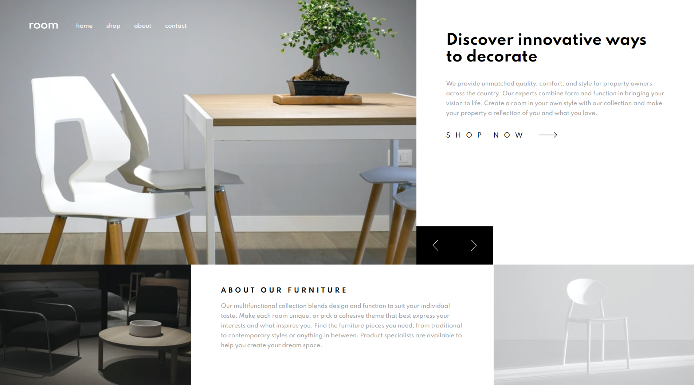
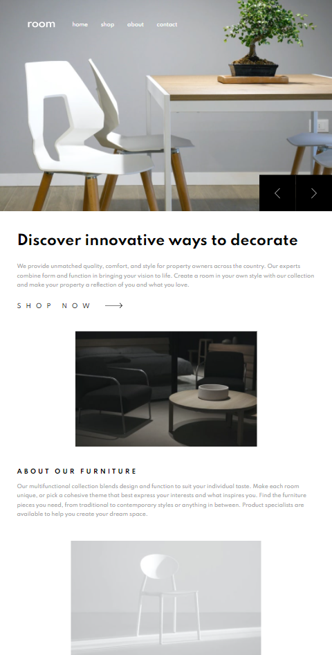
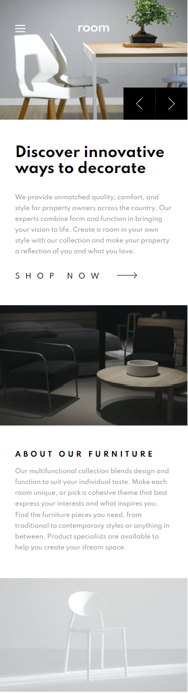
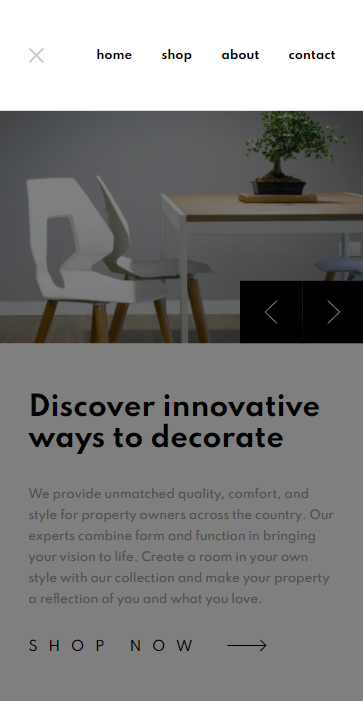

# Frontend Mentor - Room homepage solution

This is a solution to the [Room homepage challenge on Frontend Mentor](https://www.frontendmentor.io/challenges/room-homepage-BtdBY_ENq). Frontend Mentor challenges help you improve your coding skills by building realistic projects. 

## Table of contents

- [Overview](#overview)
  - [The challenge](#the-challenge)
  - [Screenshot](#screenshot)
  - [Links](#links)
- [My process](#my-process)
  - [Built with](#built-with)
  - [What I learned](#what-i-learned)
  - [Continued development](#continued-development)
  - [Useful resources](#useful-resources)
- [Author](#author)

## Overview

### The challenge

Users should be able to:

- View the optimal layout for the site depending on their device's screen size
- See hover states for all interactive elements on the page
- Navigate the slider using either their mouse/trackpad or keyboard

### Screenshot






### Links

- Solution URL: [Room Homepage Frontend Mentor Solution](https://github.com/MohMostafa-Web/room-homepage-frontend-mentor)
- Live Site URL: [Room Homepage Live Site](https://mohmostafa-web.github.io/room-homepage-frontend-mentor/)

## My process

### Built with

- Semantic HTML5 markup [header, nav, section]
- CSS custom properties [CSS varaibles, Media Queries]
- Flexbox
- Pure JS

### What I learned

- Change background color for an image using css property filter, see code below:

```html
<div class="controls">
  <a class="prev" href="#">
    
  </a>
  <a class="next" href="#">
    
  </a>
</div>
```
```css
.slider .slides-content .slide a img {
  filter: invert(0%) sepia(0%) saturate(7500%) hue-rotate(16deg) brightness(96%) contrast(103%);
  -webkit-filter: invert(0%) sepia(0%) saturate(7500%) hue-rotate(16deg) brightness(96%) contrast(103%);
  margin-left: 10px;
}
.slider .slides-content .slide a:hover img {
  filter: invert(67%) sepia(5%) saturate(4%) hue-rotate(354deg) brightness(95%) contrast(88%);
  -webkit-filter: invert(67%) sepia(5%) saturate(4%) hue-rotate(354deg) brightness(95%) contrast(88%);
}
```

- Improved my skills to use media queries in many cases. Here's an example of css code, see code below:

```css
@media (max-width: 1199px) {
  header {
    width: 100%;
  }
}
@media (max-width: 575px) {
  header {
    padding: 50px 15px;
  }
  header.bg-white {
    background-color: var(--white);
    position: relative;
  }
  header.bg-white .container {
    justify-content: flex-end;
  }
}
```

- Create a dynamic slider using pure JS, see code below:

```js
// Create variable currentSlider
let currentSlider = 1;

nextButton.onclick= function () {
  if (currentSlider === sliderImages.length) {
    currentSlider = 1;
  } else {
    currentSlider++;
  }
  sliding();
}

prevButton.onclick= function () {
  if (currentSlider === 1) {
    currentSlider = sliderImages.length;
  } else {
    currentSlider--;
  }
  sliding();
}

// Create Main Function Sliding
function sliding() {
  // Remove Class "active" from all slide Images and add Class "active" to current slide Image
  sliderImages.forEach( img => {
    img.classList.remove("active");
  });
  sliderImages[currentSlider - 1].classList.add("active");

  // Remove Class "active" from all slides Content and add Class "active" to current slide Content
  slidesContent.forEach(slide => {
    slide.classList.remove("active")
  });
  slidesContent[currentSlider - 1].classList.add("active");
}
```

### Continued development

In the future, I will use more frameworks like bootstrap, jQuery, js plugins or react js

### Useful resources

- [stackoverflow](https://stackoverflow.com/questions/24933430/img-src-svg-changing-the-styles-with-css) - This helped to change background color for an image using css property filter.
- [Elzero Web School](https://elzero.org/js-tuts-create-slider/) - This helped me to create a dynamic slider using pure js

## Author

- Linkedin - [Mohamed Mostafa](https://www.linkedin.com/in/mohamed-mostafa-4a08aa1a2/)
- Frontend Mentor - [@MohMostafa-Web](https://www.frontendmentor.io/profile/MohMostafa-Web)
- Github - [@MohMostafa-Web](https://github.com/MohMostafa-Web)
